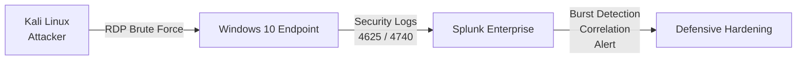
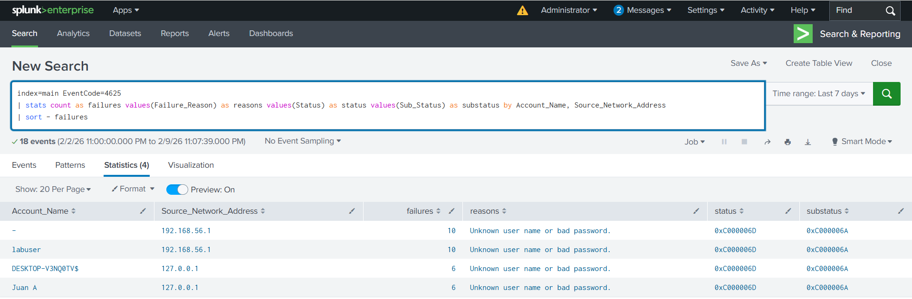
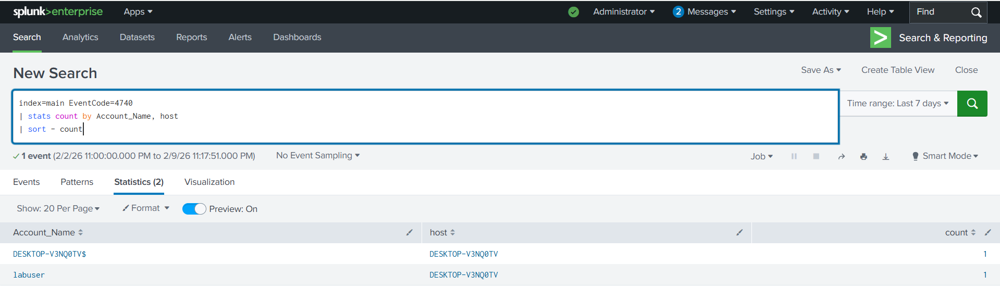
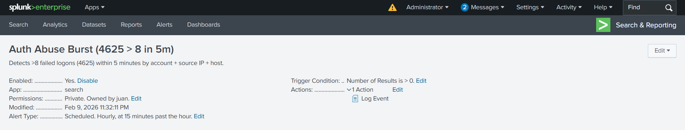
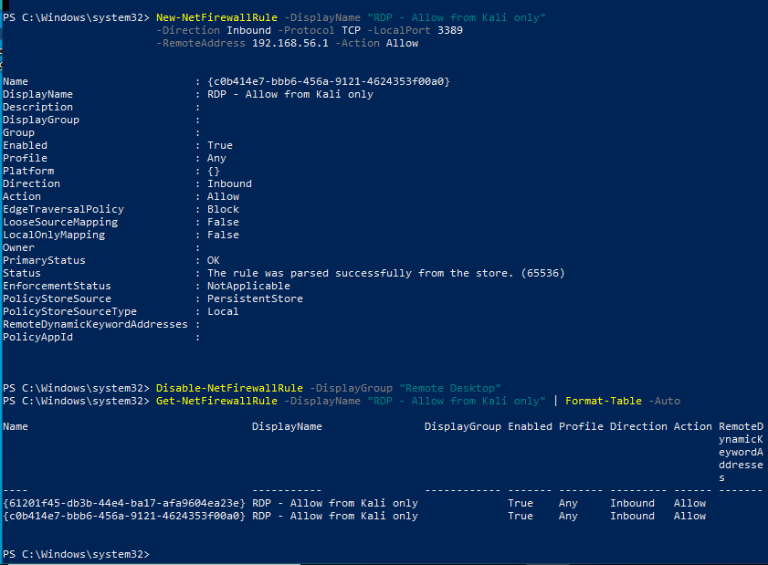

# kali-to-splunk-authentication-detection



---

## Overview

This project demonstrates end-to-end authentication abuse detection using Kali Linux to simulate adversarial behavior and Splunk to detect, correlate, and respond to failed logon activity on a Windows endpoint.

Rather than stopping at log visibility, this experiment focuses on:

- Detection engineering  
- Adversary technique mapping  
- Event correlation  
- Alert operationalization  
- Post-detection hardening  

This marks the final experiment of **Phase 1 — Endpoint Visibility Foundation**.

---

## Lab Architecture

**Attacker:** Kali Linux  
**Target:** Windows 10 Endpoint (RDP enabled)  
**SIEM:** Splunk Enterprise  
**Log Forwarder:** Splunk Universal Forwarder  

### Logs Ingested

- Security  
- System  
- Application  
- Sysmon (Operational)

---

## Objective

- Simulate repeated RDP authentication attempts  
- Detect EventCode 4625 burst behavior  
- Trigger and detect EventCode 4740 account lockout  
- Correlate failure → lockout sequence  
- Map detection logic to MITRE ATT&CK  
- Convert detection logic into a scheduled Splunk alert  
- Implement defensive hardening by restricting RDP exposure  

---

## Attack Simulation (Kali)

Controlled failed RDP authentication attempts were executed from Kali against a Windows local account (`labuser`).

This generated:

- **EventCode 4625 — Failed Logon**
- **Logon Type 3 — Network Logon**
- **Status:** `0xC000006D`
- **SubStatus:** `0xC000006A`
- **Source_Network_Address:** Kali IP

Ten failed attempts were generated within a five-minute window to simulate brute-force behavior.

---

## Detection Engineering (Splunk)

### Burst Detection Query

```spl
index=main EventCode=4625
| bin _time span=5m
| stats count as failures values(Logon_Type) as logon_types by _time, Account_Name, Source_Network_Address, host
| where failures > 8
| sort - failures
```

This query identifies authentication abuse when failed logons exceed a defined threshold within a defined time window.

### Detection Components

- Time-based aggregation  
- Threshold logic  
- Account targeting visibility  
- Source IP attribution  

---

## MITRE ATT&CK Mapping

This detection aligns with the MITRE ATT&CK framework:

### Tactic  
**TA0006 — Credential Access**

Adversaries attempt to steal or obtain credentials to gain unauthorized access to systems and services.

### Technique  
**T1110 — Brute Force**

Adversaries may attempt to gain access to accounts by systematically attempting multiple passwords against one or more user accounts.

### In This Lab

- Repeated RDP authentication attempts simulated brute-force activity  
- EventCode 4625 represented failed credential attempts  
- Threshold-based detection identified abnormal authentication volume  
- EventCode 4740 indicated defensive lockout enforcement  

RDP brute-force attacks are commonly observed in real-world intrusion attempts, particularly against externally exposed services. Mapping this detection logic to ATT&CK demonstrates alignment between adversary behavior and defensive monitoring.

Going forward, MITRE ATT&CK mapping will be consistently incorporated into detection engineering projects where applicable.

---

## Lockout Correlation

Windows account lockout policy was configured:

```powershell
net accounts /lockoutthreshold:5 /lockoutduration:5 /lockoutwindow:5
```

After exceeding the threshold, Windows generated:

- **EventCode 4740 — Account Lockout**

### Correlation Query

```spl
index=main (EventCode=4625 OR EventCode=4740)
| eval event=case(EventCode=4625,"FAIL (4625)", EventCode=4740,"LOCKOUT (4740)")
| table _time host Account_Name Source_Network_Address Logon_Type event Failure_Reason Status Sub_Status
| sort 0 _time
```

This confirms the authentication abuse lifecycle:

**Failure → Repeated Failure → Lockout Enforcement**

---

## Alert Engineering

A scheduled Splunk alert was created:

**Auth Abuse Burst (4625 > 8 in 5m)**

- Scheduled every 1 minute  
- Time range: Last 5 minutes  
- Trigger when results > 0  
- Log Event action enabled  

This transitions detection logic from investigative search to operational monitoring.

---

## Defensive Hardening

Following detection validation, RDP exposure was restricted.

### Allow RDP only from Kali host

```powershell
New-NetFirewallRule -DisplayName "RDP - Allow from Kali only" `
-Direction Inbound -Protocol TCP -LocalPort 3389 `
-RemoteAddress 192.168.56.1 -Action Allow
```

### Disable broad RDP rule

```powershell
Disable-NetFirewallRule -DisplayGroup "Remote Desktop"
```

### Result

- RDP limited to a controlled source  
- Reduced attack surface  
- Demonstrated defensive response following detection  

---

## Screenshots (Validation Evidence)

### 4625 Burst Detection (Enriched)


### 4740 Account Lockout Event


### 4625 → 4740 Correlation Validation


### Alert Configuration


### RDP Hardening – Kali Only Firewall Rule


---

## Key Takeaways

- Practical understanding of Windows authentication telemetry  
- Interpretation of EventCode 4625 and 4740  
- Significance of Logon Type 3 (network logon)  
- Forensic meaning of Status and SubStatus codes  
- Threshold-based detection design  
- Multi-event correlation strategy  
- MITRE ATT&CK technique alignment  
- Transition from visibility → detection → hardening  

---

## Phase 1 Outcome

Phase 1 evolved from validating log ingestion to engineering threat-informed detection logic and implementing defensive controls.

This project demonstrates the ability to:

- Simulate adversary behavior  
- Engineer time-based detection logic  
- Correlate multi-event attack progression  
- Map detection to MITRE ATT&CK  
- Operationalize alerting  
- Harden exposed services  

**Phase 1 — Endpoint Visibility Foundation complete.**
